# Phase 02 – OPNsense Three-Zone Network Configuration

## 1. Objective

The objective of Phase 02 is to configure **OPNsense as the central firewall** with three separate network zones:

* **WAN** – Internet connectivity
* **LAN** – Internal network
* **DMZ** – Isolated network for lab/server systems

The network environment is implemented using **VMware Workstation virtual networks**.

---

## 2. Lab Architecture
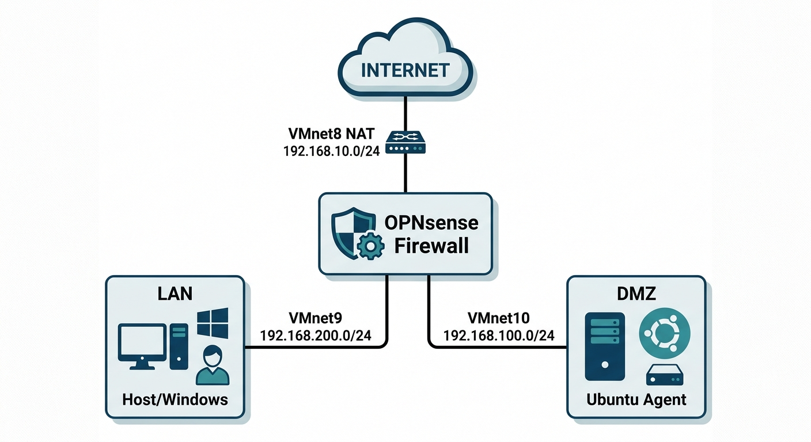

## 3. VMware Network Configuration

| VMnet   | Type      | Subnet             | Purpose        |
| ------- | --------- | ------------------ | -------------- |
| VMnet8  | NAT       | `192.168.10.0/24`  | WAN / Internet |
| VMnet9  | Host-only | `192.168.200.0/24` | LAN            |
| VMnet10 | Host-only | `192.168.100.0/24` | DMZ            |

---

## 4. OPNsense Interface Configuration

| Interface | Device | Network | IP Address          | Role         |
| --------- | ------ | ------- | ------------------- | ------------ |
| WAN       | `em0`  | VMnet8  | `192.168.10.134/24` | Internet/WAN |
| LAN       | `em1`  | VMnet9  | `192.168.200.1/24`  | Internal LAN |
| DMZ       | `em2`  | VMnet10 | `192.168.100.1/24`  | DMZ          |

### Interface Mapping

```text
WAN → em0 → 192.168.10.134/24
LAN → em1 → 192.168.200.1/24
DMZ → em2 → 192.168.100.1/24
```

### Screenshot

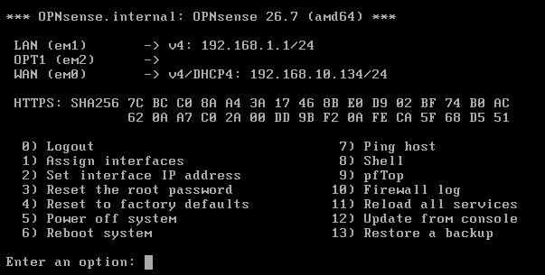

---

## 5. LAN Configuration

### LAN Interface

| Parameter  | Value              |
| ---------- | ------------------ |
| Interface  | LAN                |
| Device     | `em1`              |
| IP Address | `192.168.200.1/24` |
| Network    | `192.168.200.0/24` |

### LAN DHCP Range

```text
Start : 192.168.200.100
End   : 192.168.200.200
```

### Screenshot

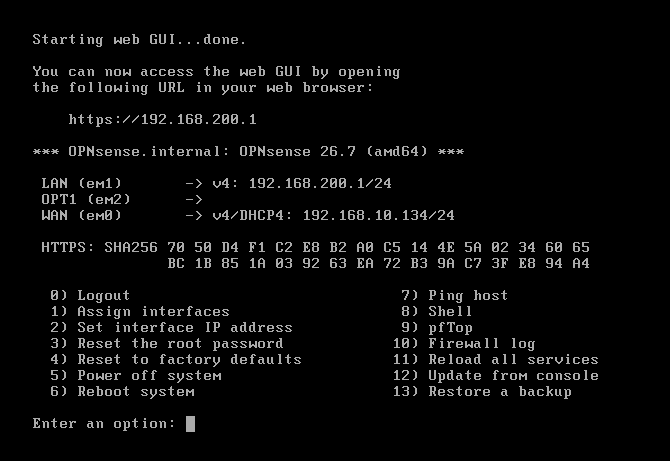

---

## 6. WAN, LAN and DMZ IP Configuration

The three OPNsense interfaces were configured with separate IP networks:

| Interface | IP Address          | Network            |
| --------- | ------------------- | ------------------ |
| WAN       | `192.168.10.134/24` | `192.168.10.0/24`  |
| LAN       | `192.168.200.1/24`  | `192.168.200.0/24` |
| DMZ       | `192.168.100.1/24`  | `192.168.100.0/24` |

### Screenshot

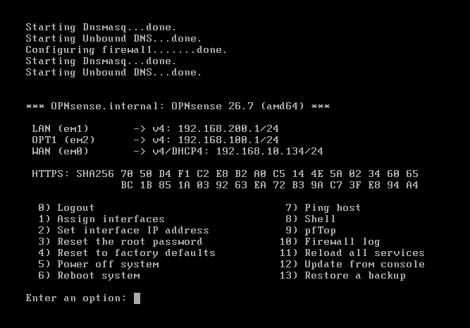

---

## 7. OPNsense Web GUI

The OPNsense Web GUI is accessible from the LAN network using:

```text
https://192.168.200.1
```

The Web GUI was successfully accessed from the LAN environment.

### Screenshot

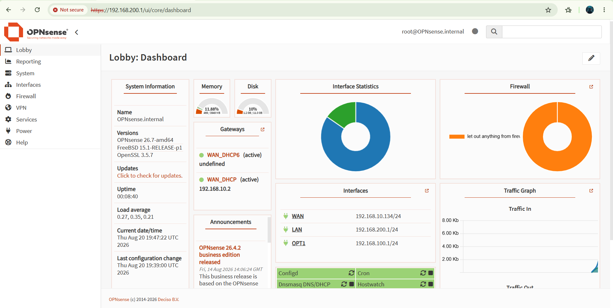

---

## 8. Interface Assignment

The VMware virtual network adapters were assigned to OPNsense as follows:

| Network | OPNsense Interface | Device |
| ------- | ------------------ | ------ |
| WAN     | WAN                | `em0`  |
| LAN     | LAN                | `em1`  |
| DMZ     | DMZ                | `em2`  |

### Screenshot

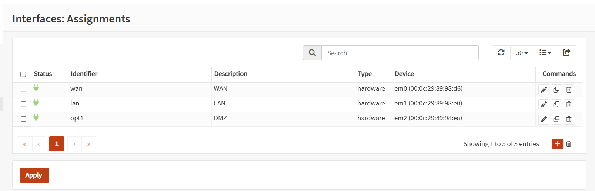

---

## 9. Interface Overview

The OPNsense interface overview was verified to confirm that all three interfaces were active and correctly configured.

### Screenshot

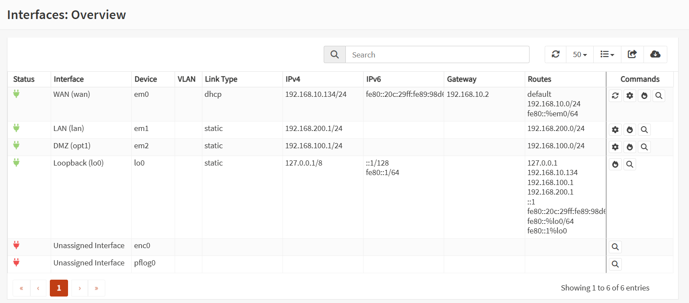

---

## 10. DHCP Configuration

DHCP services were configured for both the LAN and DMZ networks using DNSmasq.

| Interface | DHCP Start        | DHCP End          |
| --------- | ----------------- | ----------------- |
| LAN       | `192.168.200.100` | `192.168.200.200` |
| DMZ       | `192.168.100.100` | `192.168.100.200` |

### Screenshot

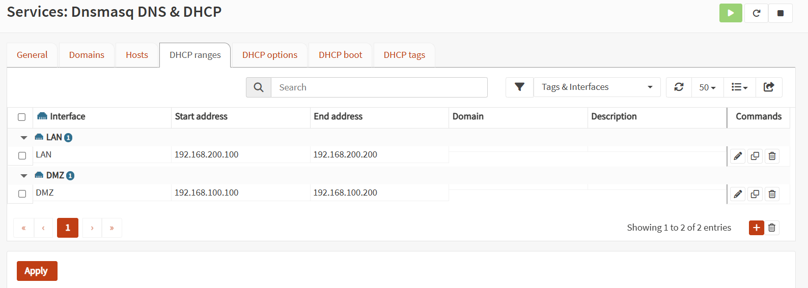

---

## 11. DMZ Configuration

The DMZ network uses:

| Parameter  | Value                               |
| ---------- | ----------------------------------- |
| Interface  | DMZ                                 |
| Device     | `em2`                               |
| IP Address | `192.168.100.1/24`                  |
| Network    | `192.168.100.0/24`                  |
| DHCP Range | `192.168.100.100 – 192.168.100.200` |

The Ubuntu DMZ test machine was configured with:

| Parameter  | Value               |
| ---------- | ------------------- |
| Interface  | `ens37`             |
| IP Address | `192.168.100.10/24` |
| Gateway    | `192.168.100.1`     |

---

# 12. Connectivity Testing

## 12.1 Windows → OPNsense LAN

The Windows host successfully reached the OPNsense LAN gateway.

```text
Destination : 192.168.200.1
Packet Loss : 0%
```

**Result: PASS**

### Screenshot

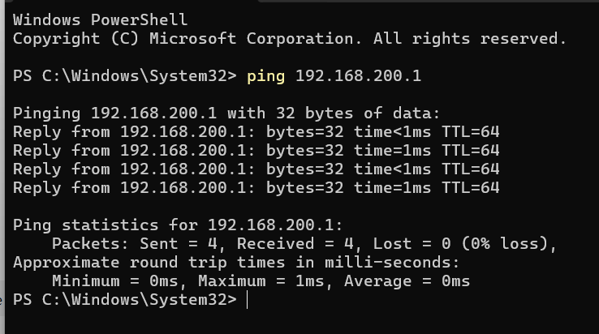

---

## 12.2 WAN → Internet

Internet connectivity through the OPNsense WAN interface was verified using:

```bash
ping 8.8.8.8
```

### Result

```text
Packets Sent     : 4
Packets Received : 4
Packet Loss      : 0%
```

**Result: PASS**

### Screenshot

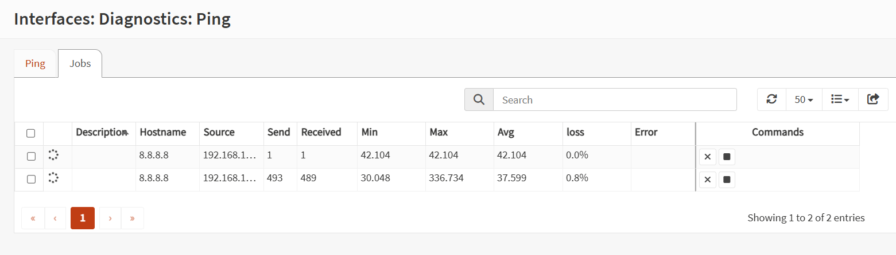

---

## 12.3 LAN → Internet and DNS

LAN Internet connectivity and DNS resolution were tested using:

```bash
ping 8.8.8.8
ping google.com
```

Both tests were successful.

**Result: PASS**

### Screenshot

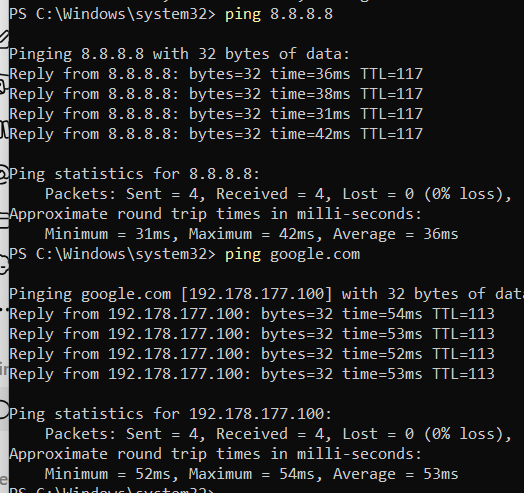

---

## 12.4 OPNsense DMZ → Ubuntu

OPNsense successfully reached the Ubuntu DMZ host.

```text
Source      : 192.168.100.1
Destination : 192.168.100.10
Packet Loss : 0%
```

**Result: PASS**

### Screenshot

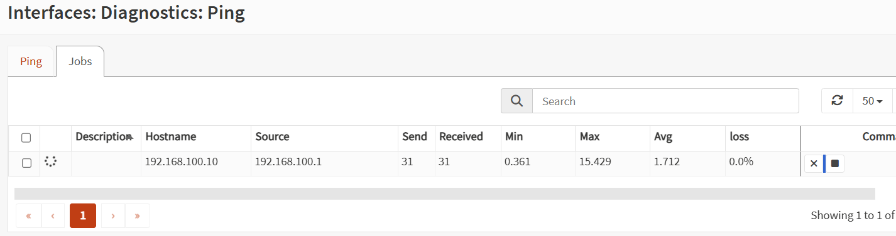

---

## 12.5 Ubuntu DMZ → Internet

Internet connectivity from the Ubuntu DMZ machine was verified using:

```bash
ping -c 4 8.8.8.8
```

### Result

```text
4 packets transmitted
4 received
0% packet loss
```

**Result: PASS**

### Screenshot

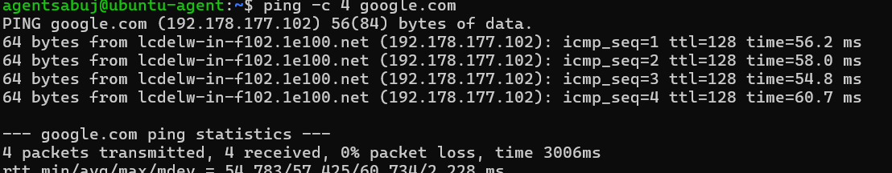

---

## 12.6 Ubuntu DMZ → DNS

DNS resolution from the Ubuntu DMZ machine was verified using:

```bash
ping -c 4 google.com
```

### Result

```text
4 packets transmitted
4 received
0% packet loss
```

**Result: PASS**

### Screenshot

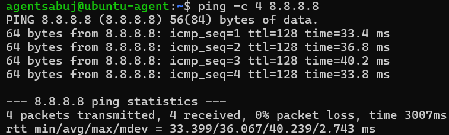

---

# 13. Final Network State

The Phase 02 three-zone network configuration is fully operational.

| Test                   | Result |
| ---------------------- | ------ |
| Windows → OPNsense LAN | ✅ PASS |
| OPNsense → Internet    | ✅ PASS |
| Windows → Internet     | ✅ PASS |
| Windows → DNS          | ✅ PASS |
| OPNsense → DMZ Ubuntu  | ✅ PASS |
| Ubuntu DMZ → Internet  | ✅ PASS |
| Ubuntu DMZ → DNS       | ✅ PASS |

---

# 14. Phase 02 Completion

Phase 02 successfully established a **three-zone OPNsense firewall architecture** using VMware Workstation.

The completed environment contains:

* **WAN network** for Internet connectivity
* **LAN network** for internal systems
* **DMZ network** for isolated lab systems
* DHCP services for LAN and DMZ
* Configured WAN, LAN and DMZ interfaces
* Verified OPNsense Web GUI access
* Verified Internet connectivity
* Verified DNS resolution
* Verified LAN connectivity
* Verified OPNsense-to-DMZ connectivity
* Verified Ubuntu DMZ connectivity

## Phase 02 Status

**COMPLETED ✅**

