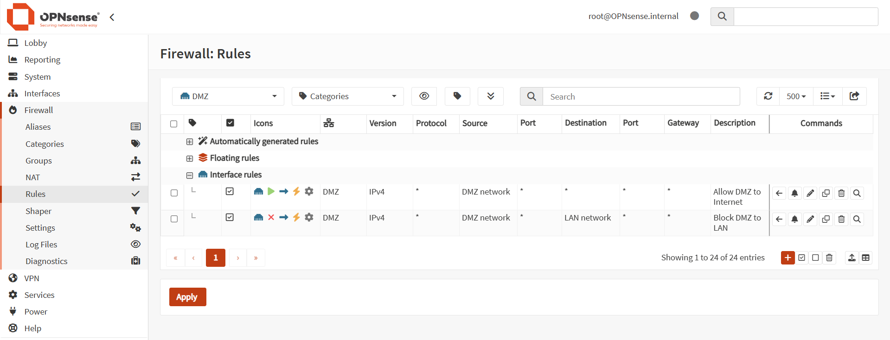
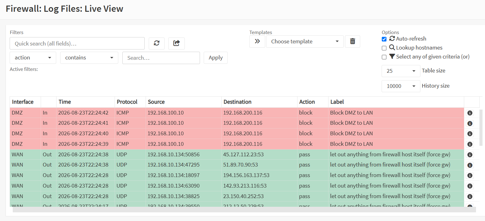
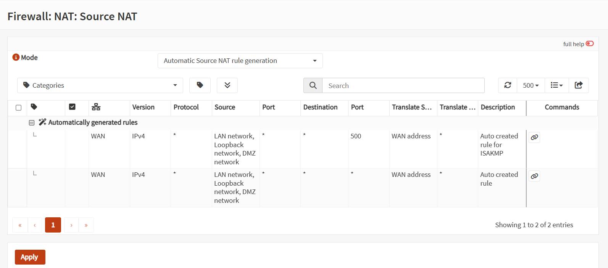
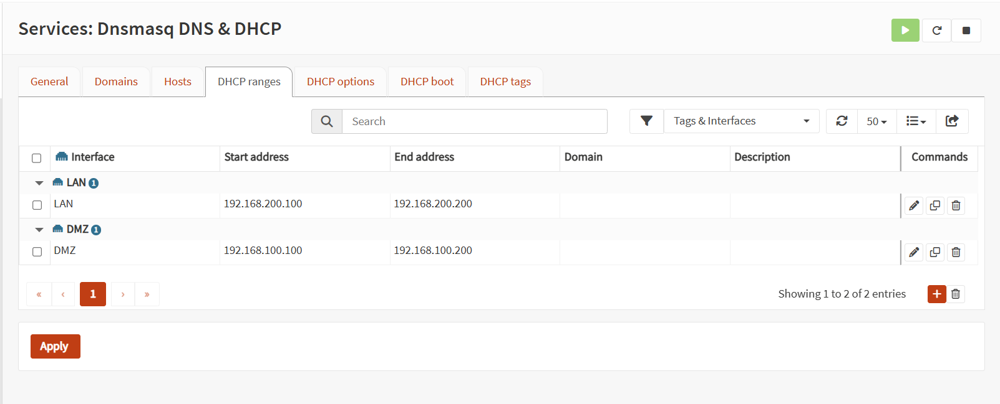
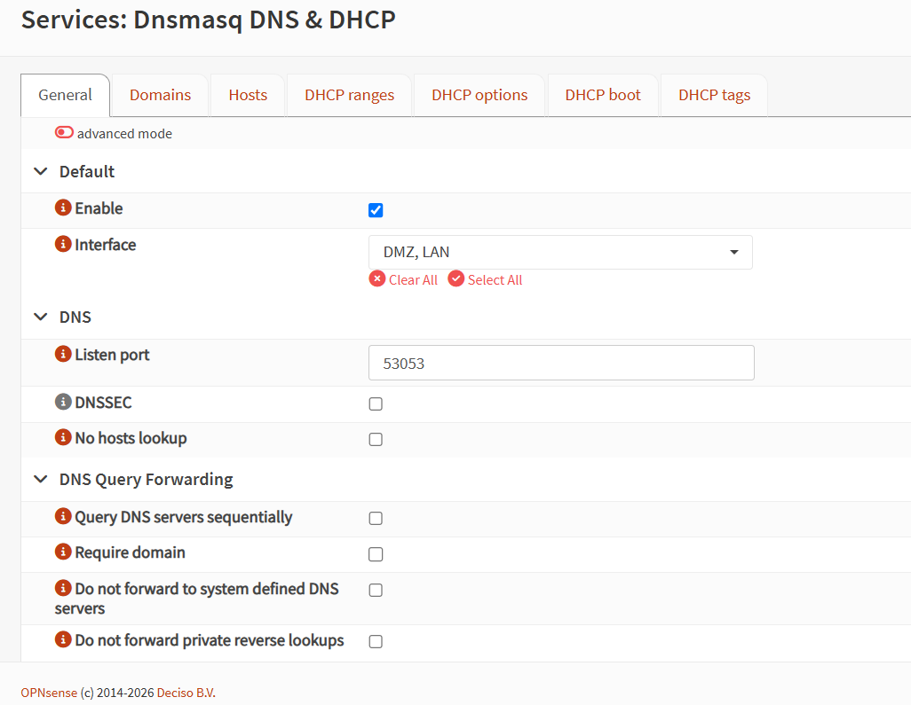
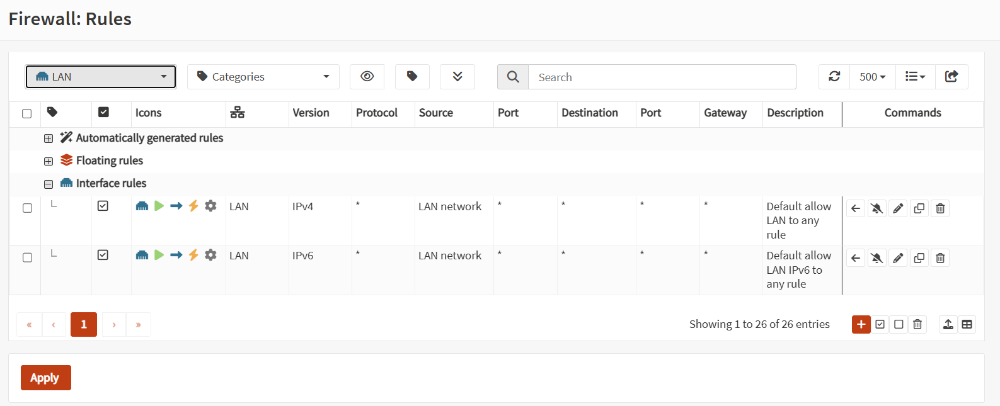
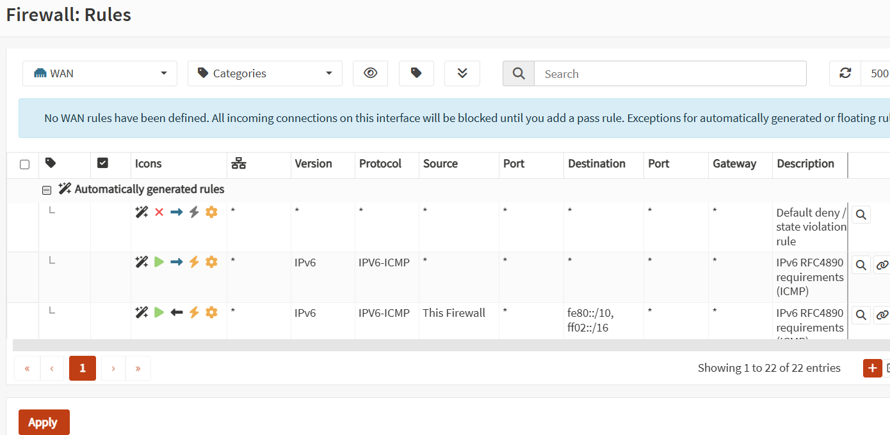
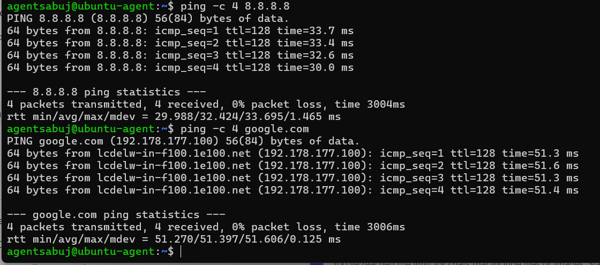
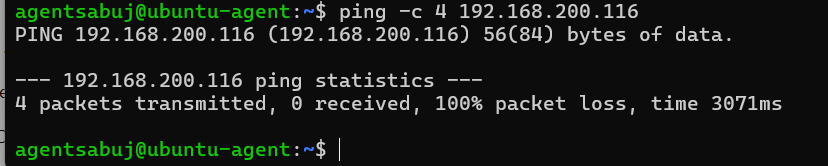
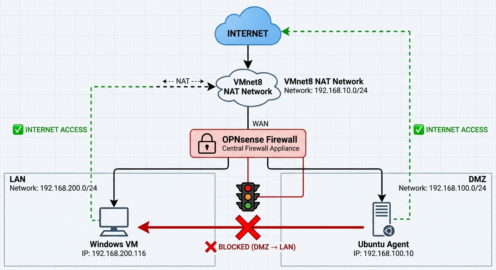

# Phase 03 — Firewall Rules and Network Segmentation

## 1. Overview

This phase focuses on configuring and validating the OPNsense firewall, NAT, DHCP/DNS services, and network segmentation for the SOC lab.

The main objectives are:

* Configure LAN and DMZ firewall policies.
* Allow DMZ systems to access the Internet.
* Prevent DMZ systems from accessing the trusted LAN.
* Configure and verify Source NAT.
* Configure DHCP ranges for LAN and DMZ.
* Verify Dnsmasq DNS/DHCP configuration.
* Validate LAN and WAN firewall policies.
* Perform connectivity and segmentation tests.

---

# 2. Lab Network Architecture

The SOC lab uses three logical network zones.

| Zone | Network            | OPNsense Gateway | Purpose                        |
| ---- | ------------------ | ---------------- | ------------------------------ |
| WAN  | `192.168.10.0/24`  | `192.168.10.2`   | Internet / VMware NAT          |
| LAN  | `192.168.200.0/24` | `192.168.200.1`  | Trusted internal network       |
| DMZ  | `192.168.100.0/24` | `192.168.100.1`  | Isolated security/network zone |

### Important Hosts

| Device       | IP Address        | Network |
| ------------ | ----------------- | ------- |
| OPNsense WAN | `192.168.10.2`    | WAN     |
| OPNsense LAN | `192.168.200.1`   | LAN     |
| OPNsense DMZ | `192.168.100.1`   | DMZ     |
| Ubuntu Agent | `192.168.100.10`  | DMZ     |
| Windows VM   | `192.168.200.116` | LAN     |

---

# 3. Security Policy

The intended firewall policy is:

```text
LAN  → Internet       ALLOW
DMZ  → Internet       ALLOW
DMZ  → OPNsense       ALLOW
DMZ  → LAN            BLOCK
WAN  → Internal       BLOCK by default
```

The main segmentation objective is:

```text
DMZ
192.168.100.0/24
      │
      │ ❌ BLOCK
      ▼
LAN
192.168.200.0/24
```

This prevents a compromised DMZ system from directly accessing trusted LAN systems.

---

# 4. DMZ Firewall Rules

Two important rules are configured on the DMZ interface:

### Rule 1 — Allow DMZ to Internet

```text
Interface:   DMZ
Action:      Pass
Direction:   In
Version:     IPv4
Protocol:    Any
Source:      DMZ network
Destination: Any
Description: Allow DMZ to Internet
```

### Rule 2 — Block DMZ to LAN

```text
Interface:   DMZ
Action:      Block
Direction:   In
Version:     IPv4
Protocol:    Any
Source:      DMZ network
Destination: LAN network
Description: Block DMZ to LAN
```

Both rules are visible in the same screenshot.

### Screenshot — DMZ Firewall Rules



[Open Full Screenshot — 01 DMZ Firewall Rules](../screenshots/phase-03/01-dmz-firewall-rules.png)

---

# 5. DMZ → LAN Block Verification

The OPNsense Live View was used to verify that traffic from the Ubuntu DMZ agent to the Windows LAN host is being blocked.

### Test

```text
Source:
192.168.100.10

Destination:
192.168.200.116

Protocol:
ICMP

Action:
block

Rule:
Block DMZ to LAN
```

The firewall log confirms that the DMZ → LAN policy is actively enforcing network isolation.

### Screenshot — Firewall Live View



[Open Full Screenshot — 02 DMZ Block Live View](../screenshots/phase-03/02-dmz-block-live-view.png)

---

# 6. Source NAT Configuration

OPNsense is configured to automatically generate Source NAT rules.

### Configuration

```text
Mode:
Automatic Source NAT rule generation
```

Automatic NAT allows internal LAN and DMZ systems to access the Internet through the OPNsense WAN interface.

### NAT Flow

```text
LAN / DMZ
    │
    ▼
OPNsense
    │
    ▼
WAN Address
    │
    ▼
Internet
```

### Screenshot — Source NAT



[Open Full Screenshot — 03 Source NAT](../screenshots/phase-03/03-source-nat.png)

---

# 7. DHCP Configuration

Dnsmasq DHCP ranges were configured for both LAN and DMZ.

## LAN DHCP

```text
Network:
192.168.200.0/24

DHCP Range:
192.168.200.100 – 192.168.200.200

Gateway:
192.168.200.1
```

## DMZ DHCP

```text
Network:
192.168.100.0/24

DHCP Range:
192.168.100.100 – 192.168.100.200

Gateway:
192.168.100.1
```

The Ubuntu DMZ agent uses the static address:

```text
192.168.100.10/24
```

This address is outside the DHCP pool.

### Screenshot — DHCP Ranges



[Open Full Screenshot — 04 DHCP Ranges](../screenshots/phase-03/04-dhcp-ranges.png)

---

# 8. Dnsmasq DNS & DHCP Configuration

Dnsmasq is used to provide DNS/DHCP functionality for the internal networks.

The required internal interfaces are:

```text
LAN  → Enabled
DMZ  → Enabled
WAN  → Not used for internal DHCP/DNS
```

This avoids exposing internal DHCP/DNS services unnecessarily on the WAN interface.

### Screenshot — Dnsmasq General



[Open Full Screenshot — 05 Dnsmasq General](../screenshots/phase-03/05-dnsmasq-genera.png)

> **Filename note:** The screenshot filename is intentionally kept as `05-dnsmasq-genera.png` to match the actual file.

---

# 9. LAN Firewall Rules

The LAN interface contains the default IPv4 allow rule.

### Main LAN Rule

```text
Interface:
LAN

Version:
IPv4

Protocol:
Any

Source:
LAN network

Destination:
Any

Action:
Pass

Description:
Default allow LAN to any rule
```

This allows trusted LAN systems to communicate with permitted destinations.

### Screenshot — LAN Firewall Rules



[Open Full Screenshot — 06 LAN Firewall Rules](../screenshots/phase-03/06-lan-firewall-rules.png)

---

# 10. WAN Firewall Rules

No manual WAN inbound pass rule has been configured.

OPNsense therefore maintains the default security behavior where unsolicited inbound traffic from the WAN is blocked unless explicitly permitted.

### Security Model

```text
Internet
   │
   ▼
 WAN
   │
   ▼
OPNsense
   │
   ├── ❌ Unsolicited → LAN
   │
   └── ❌ Unsolicited → DMZ
```

### Screenshot — WAN Firewall Rules



[Open Full Screenshot — 07 WAN Firewall Rules](../screenshots/phase-03/07-wan-firewall-rules.png)

---

# 11. DMZ Internet Connectivity Test

The Ubuntu DMZ agent was tested for Internet connectivity.

### Command

```bash
ping -c 4 8.8.8.8
```

Expected successful result:

```text
4 packets transmitted
4 received
0% packet loss
```

DNS resolution was also tested using:

```bash
ping -c 4 google.com
```

The test was successful.

This confirms that:

* DMZ → OPNsense works.
* DMZ → Internet works.
* DNS resolution works.
* Source NAT is functioning.

### Screenshot — DMZ Internet Test



[Open Full Screenshot — 08 DMZ Internet Test](../screenshots/phase-03/08-dmz-internet-test.png)

---

# 12. DMZ → LAN Isolation Test

The Ubuntu DMZ agent attempted to communicate with the Windows LAN VM.

### Source

```text
Ubuntu DMZ Agent:
192.168.100.10
```

### Destination

```text
Windows LAN VM:
192.168.200.116
```

### Command

```bash
ping -c 4 192.168.200.116
```

### Expected Result

```text
4 packets transmitted
0 received
100% packet loss
```

This is the expected and correct result because the OPNsense firewall is configured to block DMZ → LAN communication.

### Screenshot — DMZ to LAN Block Test



[Open Full Screenshot — 09 DMZ LAN Block Test](../screenshots/phase-03/09-dmz-lan-block-test.png)

---

# 13. Routing Verification

The Ubuntu DMZ agent has a route to the LAN network through the OPNsense DMZ gateway.

Example:

```text
192.168.200.0/24 via 192.168.100.1 dev ens37
```

This confirms that traffic destined for the LAN is sent to OPNsense.

The firewall then applies the DMZ → LAN block policy.

Therefore:

```text
Ubuntu DMZ
192.168.100.10
      │
      ▼
OPNsense DMZ Gateway
192.168.100.1
      │
      │ ❌ Firewall Block
      ▼
Windows LAN
192.168.200.116
```

This demonstrates proper Layer-3 routing combined with firewall-based network segmentation.

---

# 14. Windows LAN Connectivity

The Windows VM is configured as:

```text
IPv4 Address:
192.168.200.116

Subnet Mask:
255.255.255.0

Default Gateway:
192.168.200.1
```

The Windows VM successfully accesses the Internet.

Example test:

```cmd
ping 8.8.8.8
```

The test returned:

```text
Packets: Sent = 4
Received = 4
Lost = 0
```

DNS was also successfully verified with:

```cmd
ping google.com
```

---

# 15. Security Validation Summary

| Test                    | Expected | Actual              | Status |
| ----------------------- | -------- | ------------------- | ------ |
| DMZ → OPNsense          | Allow    | Successful          | PASS   |
| DMZ → Internet          | Allow    | Successful          | PASS   |
| DMZ DNS Resolution      | Allow    | Successful          | PASS   |
| DMZ → LAN               | Block    | 100% loss           | PASS   |
| LAN → Internet          | Allow    | Successful          | PASS   |
| Windows → Internet      | Allow    | Successful          | PASS   |
| Source NAT              | Enabled  | Automatic           | PASS   |
| WAN unsolicited inbound | Block    | No manual pass rule | PASS   |

---

# 16. Final Network Segmentation

The completed OPNsense security architecture is:




# 17. Phase 03 Completion Checklist

* [x] WAN configuration verified
* [x] LAN configuration verified
* [x] DMZ configuration verified
* [x] DMZ → Internet allow rule configured
* [x] DMZ → LAN block rule configured
* [x] Firewall Live View verified
* [x] Source NAT verified
* [x] LAN DHCP range configured
* [x] DMZ DHCP range configured
* [x] Dnsmasq configuration verified
* [x] LAN firewall rules verified
* [x] WAN firewall rules verified
* [x] DMZ Internet connectivity verified
* [x] DNS resolution verified
* [x] DMZ → LAN isolation verified
* [x] Windows LAN connectivity verified

---

# 18. Conclusion

Phase 03 successfully implemented the firewall rules and network segmentation required for the SOC lab.

The DMZ Ubuntu agent can access the Internet through OPNsense, while communication from the DMZ to the trusted LAN network is blocked.

The firewall Live View confirms that the `Block DMZ to LAN` rule is actively enforcing the segmentation policy.

The final security policy is:

```text
LAN  → Internet      ✅ ALLOW
DMZ  → Internet      ✅ ALLOW
DMZ  → OPNsense      ✅ ALLOW
DMZ  → LAN           ❌ BLOCK
WAN  → Internal      ❌ BLOCK by default
```

Therefore:

**Phase 03 — Firewall Rules and Network Segmentation: COMPLETE ✅**

---

# 19. Screenshot Index

| No. | Screenshot                                                                       | Purpose                     |
| --- | -------------------------------------------------------------------------------- | --------------------------- |
| 01  | [01-dmz-firewall-rules.png](../screenshots/phase-03/01-dmz-firewall-rules.png)   | DMZ Allow + Block rules     |
| 02  | [02-dmz-block-live-view.png](../screenshots/phase-03/02-dmz-block-live-view.png) | Firewall block verification |
| 03  | [03-source-nat.png](../screenshots/phase-03/03-source-nat.png)                   | Source NAT                  |
| 04  | [04-dhcp-ranges.png](../screenshots/phase-03/04-dhcp-ranges.png)                 | LAN/DMZ DHCP                |
| 05  | [05-dnsmasq-genera.png](../screenshots/phase-03/05-dnsmasq-genera.png)           | Dnsmasq configuration       |
| 06  | [06-lan-firewall-rules.png](../screenshots/phase-03/06-lan-firewall-rules.png)   | LAN rules                   |
| 07  | [07-wan-firewall-rules.png](../screenshots/phase-03/07-wan-firewall-rules.png)   | WAN security                |
| 08  | [08-dmz-internet-test.png](../screenshots/phase-03/08-dmz-internet-test.png)     | DMZ Internet/DNS test       |
| 09  | [09-dmz-lan-block-test.png](../screenshots/phase-03/09-dmz-lan-block-test.png)   | DMZ → LAN isolation         |

---

# 20. Next Phase

After completing the firewall rules and network segmentation phase, the next phase will focus on configuring and validating Network Address Translation (NAT) in OPNsense.

The NAT phase will verify outbound NAT for both the LAN and DMZ networks and confirm that internal systems can access the Internet through the OPNsense WAN interface.