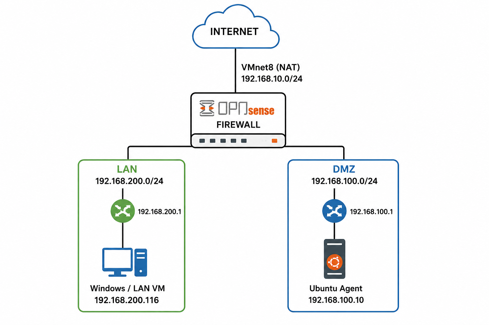
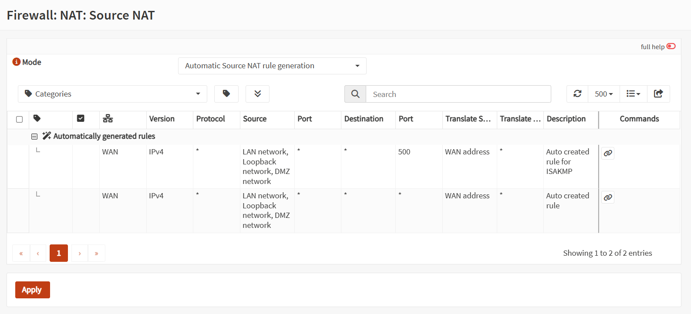
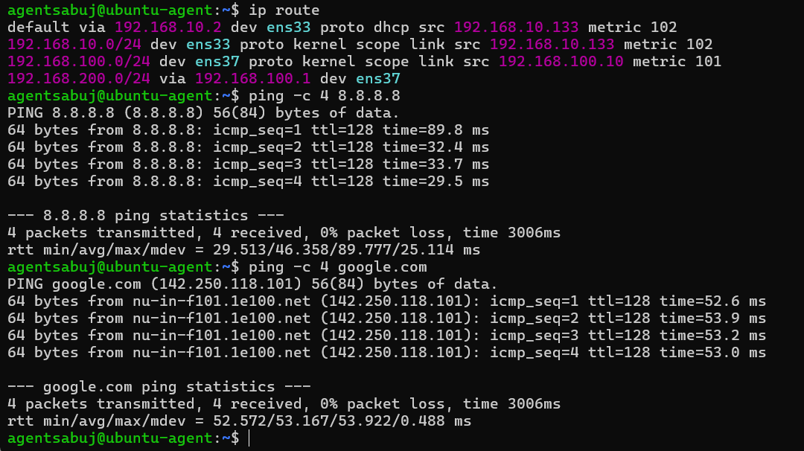
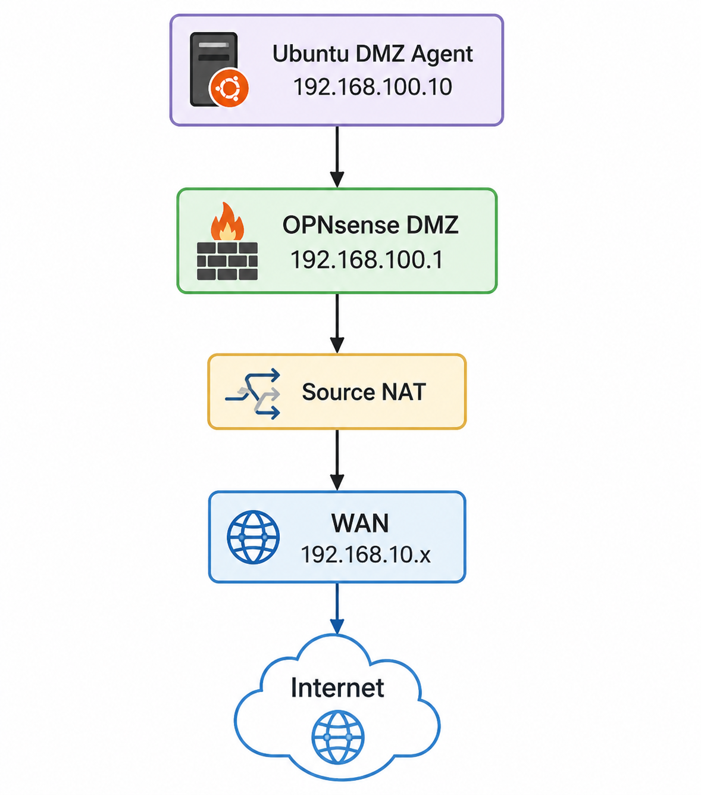
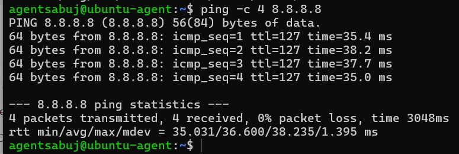
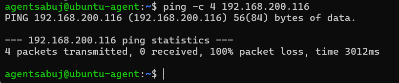
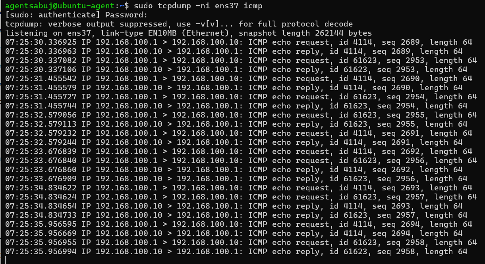

# Phase 04 – NAT and DMZ Internet Validation

## 1. Overview

This phase focuses on configuring and validating **Network Address Translation (NAT)** and Internet connectivity for the DMZ network in the OPNsense firewall lab.

The main objectives are:

* Verify Source NAT configuration.
* Verify DMZ gateway connectivity.
* Verify DMZ-to-Internet connectivity.
* Verify DMZ-to-LAN segmentation.
* Capture ICMP traffic using `tcpdump`.
* Confirm that the firewall correctly routes and translates DMZ traffic.

---

## 2. Lab Network Architecture

The current lab uses the following network structure:



### Interface Summary

| Interface | Network          | OPNsense IP   | Purpose          |
| --------- | ---------------- | ------------- | ---------------- |
| WAN       | 192.168.10.0/24  | DHCP          | Internet/WAN     |
| LAN       | 192.168.200.0/24 | 192.168.200.1 | Internal network |
| DMZ       | 192.168.100.0/24 | 192.168.100.1 | Isolated network |

### Ubuntu DMZ Agent

```text
IP Address : 192.168.100.10
Gateway    : 192.168.100.1
Interface  : ens37
```

---

# 3. Source NAT Configuration

Source NAT is responsible for translating private internal addresses into the WAN address when internal hosts access the Internet.

Navigate to:

**Firewall → NAT → Source NAT**

The configured mode is:

```text
Automatic Source NAT rule generation
```

OPNsense automatically generates the required Source NAT rules for internal networks.

### Source NAT Screenshot




**Evidence:** `01-source-nat.png`

---

# 4. DMZ Gateway Connectivity Test

The first validation verifies communication between the Ubuntu DMZ Agent and the OPNsense DMZ gateway.

### Command

```bash
ping -c 4 192.168.100.1
```

### Expected Result

```text
4 packets transmitted, 4 received, 0% packet loss
```

### Actual Result

```text
4 packets transmitted, 4 received, 0% packet loss
```

This confirms that the Ubuntu Agent can successfully communicate with the OPNsense DMZ interface.

**Status: PASS**

### Screenshot




**Evidence:** `02-dmz-gateway-test.png`

---

# 5. DMZ-to-Internet Connectivity Test

The next test verifies whether the DMZ network can access the Internet through OPNsense.

### Command

```bash
ping -c 4 8.8.8.8
```

### Actual Result

```text
4 packets transmitted, 4 received, 0% packet loss
```

The successful response confirms that traffic is following the expected path:



### Result

DMZ-to-Internet connectivity is working successfully.

**Status: PASS**

### Screenshot




**Evidence:** `03-dmz-internet-test.png`

---

# 6. DMZ-to-LAN Segmentation Test

The DMZ should be able to access the Internet but should **not** be allowed to directly access the protected LAN network.

The LAN host used for testing is:

```text
LAN Host:
192.168.200.116
```

### Command

```bash
ping -c 4 192.168.200.116
```

### Actual Result

```text
4 packets transmitted, 0 received, 100% packet loss
```

The 100% packet loss is expected because the OPNsense firewall contains a rule blocking:

```text
Source:
DMZ network

Destination:
LAN network

Action:
Block
```

Therefore, the DMZ cannot directly communicate with the LAN host.

**Status: PASS**

### Screenshot




**Evidence:** `04-dmz-lan-block-test.png`

---

# 7. ICMP Packet Capture Verification

Packet-level verification was performed using `tcpdump` on the Ubuntu DMZ Agent.

### Command

```bash
sudo tcpdump -ni ens37 icmp
```

The packet capture showed ICMP echo requests and replies:

```text
192.168.100.1 > 192.168.100.10: ICMP echo request

192.168.100.10 > 192.168.100.1: ICMP echo reply
```

This confirms:

1. OPNsense sends the ICMP request.
2. Ubuntu receives the request.
3. Ubuntu generates an ICMP reply.
4. The reply is returned through the DMZ interface.

### Result

ICMP communication between the OPNsense DMZ interface and Ubuntu Agent was successfully confirmed at packet level.

**Status: PASS**

### Screenshot




**Evidence:** `05-dmz-packet-capture.png`

---

# 8. Routing Verification

The Ubuntu Agent routing table was verified to ensure that Internet-bound traffic uses the OPNsense DMZ gateway.

### Command

```bash
ip route
```

The expected default route is:

```text
default via 192.168.100.1 dev ens37
```

The route to the Internet was also verified:

```bash
ip route get 8.8.8.8
```

Expected result:

```text
8.8.8.8 via 192.168.100.1 dev ens37
```

This confirms that the DMZ host sends Internet-bound traffic to OPNsense.

---

# 9. NAT and Connectivity Flow

The complete traffic flow is:


The DMZ host can access the Internet because Source NAT translates the private DMZ address before the traffic leaves through the WAN interface.

# 10. Security Segmentation

The firewall implements the following security model:


This provides basic network segmentation between the trusted LAN and less-trusted DMZ.

# 11. Validation Results

| Test                   | Expected Result      | Actual Result    | Status |
| ---------------------- | -------------------- | ---------------- | ------ |
| DMZ → OPNsense Gateway | Reachable            | 0% packet loss   | PASS   |
| DMZ → Internet         | Allowed              | 0% packet loss   | PASS   |
| DMZ → LAN              | Blocked              | 100% packet loss | PASS   |
| ICMP Packet Capture    | Request + Reply      | Captured         | PASS   |
| DMZ Default Route      | 192.168.100.1        | Verified         | PASS   |
| Source NAT             | Translation required | Working          | PASS   |

---

# 12. Evidence Files

All Phase 04 screenshots are stored in:

```text
screenshots/
└── phase-04/
    ├── 01-source-nat.png
    ├── 02-dmz-gateway-test.png
    ├── 03-dmz-internet-test.png
    ├── 04-dmz-lan-block-test.png
    └── 05-dmz-packet-capture.png
```

### Screenshot Index

| #  | Screenshot                                                                     | Description                    |
| -- | ------------------------------------------------------------------------------ | ------------------------------ |
| 01 | [01-source-nat.png](../screenshots/phase-04/01-source-nat.png)                 | Source NAT configuration       |
| 02 | [02-dmz-gateway-test.png](../screenshots/phase-04/02-dmz-gateway-test.png)     | DMZ gateway connectivity       |
| 03 | [03-dmz-internet-test.png](../screenshots/phase-04/03-dmz-internet-test.png)   | DMZ Internet connectivity      |
| 04 | [04-dmz-lan-block-test.png](../screenshots/phase-04/04-dmz-lan-block-test.png) | DMZ-to-LAN blocking validation |
| 05 | [05-dmz-packet-capture.png](../screenshots/phase-04/05-dmz-packet-capture.png) | ICMP packet capture            |

---

# 13. Final Verification

The following conditions were successfully verified:

* [x] OPNsense DMZ interface is configured as `192.168.100.1/24`.
* [x] Ubuntu DMZ Agent is configured as `192.168.100.10/24`.
* [x] DMZ default gateway is `192.168.100.1`.
* [x] DMZ can communicate with the OPNsense gateway.
* [x] DMZ can access the Internet.
* [x] Source NAT is functioning.
* [x] DMZ cannot directly access the LAN host.
* [x] ICMP traffic was verified using `tcpdump`.
* [x] Network routing was verified using `ip route`.

---

# 14. Conclusion

Phase 04 successfully validated the NAT configuration and DMZ network connectivity of the OPNsense firewall lab.

The testing confirmed that the DMZ network:

* Can communicate with its OPNsense gateway.
* Can access the Internet through Source NAT.
* Cannot directly access the protected LAN network.
* Uses `192.168.100.1` as its default gateway.
* Successfully exchanges ICMP traffic with the OPNsense DMZ interface.

Therefore:

> **Phase 04 – NAT and DMZ Internet Validation: COMPLETED**

---

# 15. Next Phase

The next phase will focus on **DMZ Segmentation and Security Testing**.

The planned workflow is:


After completing the segmentation and security testing phases, the lab will proceed toward the **Wazuh-based SOC monitoring and centralized security log analysis environment**.
