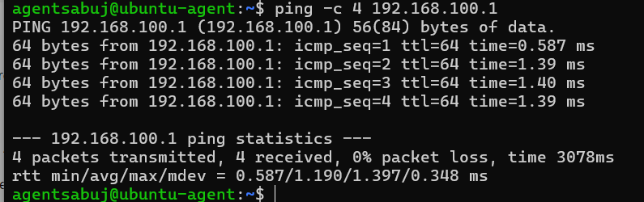
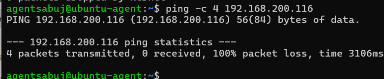
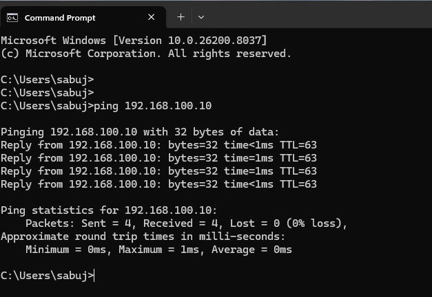
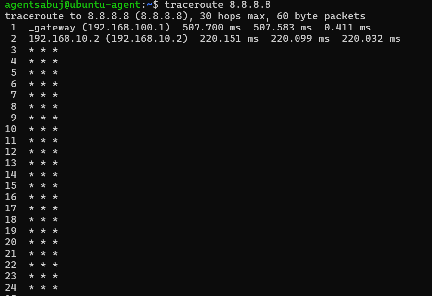
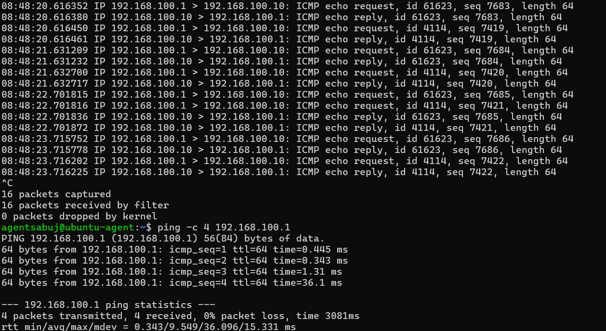
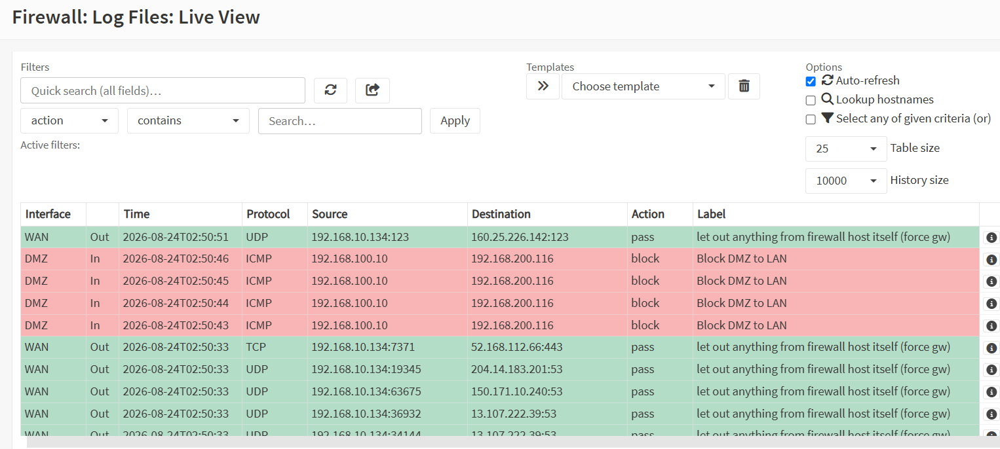
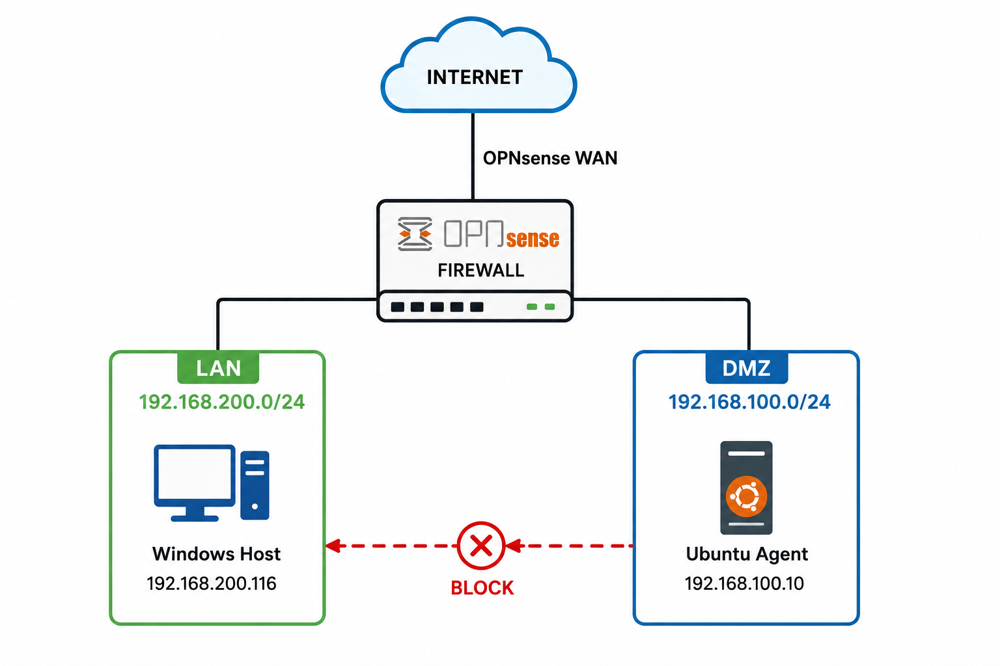

# Phase 05: DMZ Segmentation and Security Testing

## 1. Overview

This phase verifies the network segmentation implemented using OPNsense. The objective is to confirm that the DMZ network can access the Internet while remaining isolated from the trusted LAN network.

The DMZ network uses:

* **DMZ Network:** `192.168.100.0/24`
* **DMZ Gateway:** `192.168.100.1`
* **Ubuntu DMZ Agent:** `192.168.100.10`
* **LAN Network:** `192.168.200.0/24`
* **Windows LAN Host:** `192.168.200.116`

The security model allows the DMZ to access the Internet but blocks direct access from the DMZ to the trusted LAN.

---

## 2. DMZ Network Segmentation

The following diagram represents the segmentation between the trusted LAN and the less-trusted DMZ.


The DMZ is separated from the trusted LAN through OPNsense firewall policies.

---

## 3. DMZ Gateway Connectivity Test

The first test verifies connectivity between the Ubuntu DMZ host and the OPNsense DMZ gateway.

### Command

```bash
ping -c 4 192.168.100.1
```

### Actual Result

```text
4 packets transmitted, 4 received, 0% packet loss
```

The successful response confirms that the Ubuntu DMZ host can communicate with the OPNsense DMZ gateway.



---

## 4. DMZ-to-Internet Connectivity Test

The next test verifies whether the DMZ network can access the Internet through OPNsense.

### Command

```bash
ping -c 4 8.8.8.8
```

### Actual Result

```text
4 packets transmitted, 4 received, 0% packet loss
```

The successful response confirms that Internet connectivity is available from the DMZ network.


---

## 5. DMZ-to-LAN Isolation Test

The next test verifies that the DMZ cannot directly access the trusted LAN.

### Command

```bash
ping -c 4 192.168.200.116
```

### Actual Result

```text
4 packets transmitted, 0 received, 100% packet loss
```

The 100% packet loss confirms that traffic from the DMZ host to the trusted LAN host is blocked.



This demonstrates the intended security segmentation between the DMZ and LAN networks.

---

## 6. LAN-to-DMZ Connectivity Test

The reverse-direction test verifies connectivity from the trusted LAN toward the DMZ host.

### Command

```cmd
ping 192.168.100.10
```

The result depends on the configured OPNsense firewall policy.



This test helps verify the direction-specific firewall policy between the LAN and DMZ zones.

---

## 7. DMZ Traceroute Test

Traceroute is used to identify the routing path from the DMZ host toward the Internet.

### Command

```bash
traceroute 8.8.8.8
```

The first hop should normally be the OPNsense DMZ gateway:

```text
1  192.168.100.1
```



This confirms that Internet-bound traffic from the DMZ is routed through the OPNsense firewall.

---

## 8. DMZ Packet Capture

Packet capture was performed on the Ubuntu DMZ interface to verify ICMP traffic at the network level.

### Command

```bash
sudo tcpdump -ni ens37 icmp
```

A separate terminal was used to generate ICMP traffic:

```bash
ping -c 4 192.168.100.1
```

The packet capture showed both ICMP Echo Requests and Echo Replies between:

```text
192.168.100.1
        ↕
192.168.100.10
```



This confirms that ICMP traffic is successfully traversing the DMZ interface.

---

## 9. OPNsense Firewall Live View

The OPNsense Firewall Live View was used to verify firewall activity generated by the DMZ-to-LAN isolation test.

Navigate to:

**Firewall → Log Files → Live View**

The blocked traffic generated by the DMZ host can be observed in the firewall log.



This provides firewall-level evidence that the segmentation policy is being enforced.

---

## 10. Security Validation Summary

The Phase-05 tests demonstrate the following:

| Test                   | Expected Result            | Status     |
| ---------------------- | -------------------------- | ---------- |
| DMZ → OPNsense Gateway | Allowed                    | ✅ Passed   |
| DMZ → Internet         | Allowed                    | ✅ Passed   |
| DMZ → LAN              | Blocked                    | ✅ Passed   |
| LAN → DMZ              | Policy dependent           | ✅ Tested   |
| DMZ Traceroute         | Routed through OPNsense    | ✅ Passed   |
| DMZ Packet Capture     | ICMP request/reply visible | ✅ Passed   |
| Firewall Live View     | Security event visible     | ✅ Verified |

---

## 11. Security Outcome

The completed tests confirm that the OPNsense firewall provides basic network segmentation between the trusted LAN and the less-trusted DMZ.

The DMZ host can communicate with the Internet through OPNsense and Source NAT, while direct access to the trusted LAN is blocked.

This provides the basic network security foundation required for the SOC lab.

---

## 12. Phase-05 Conclusion

Phase-05 successfully validated the DMZ segmentation and firewall security policies.

The lab now has:



The next phase will focus on **security testing and monitoring preparation**, leading toward the Wazuh-based centralized SOC monitoring environment.
