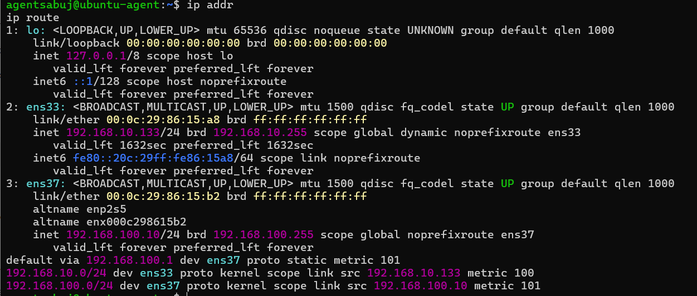
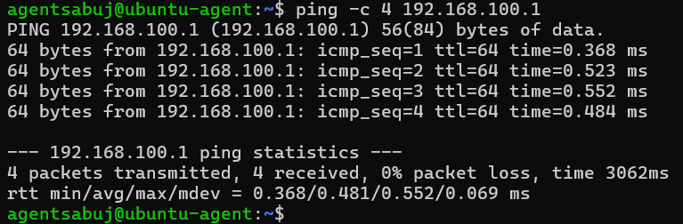
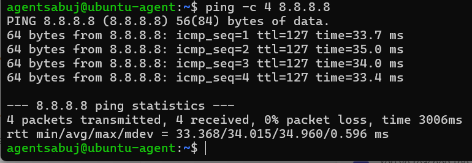
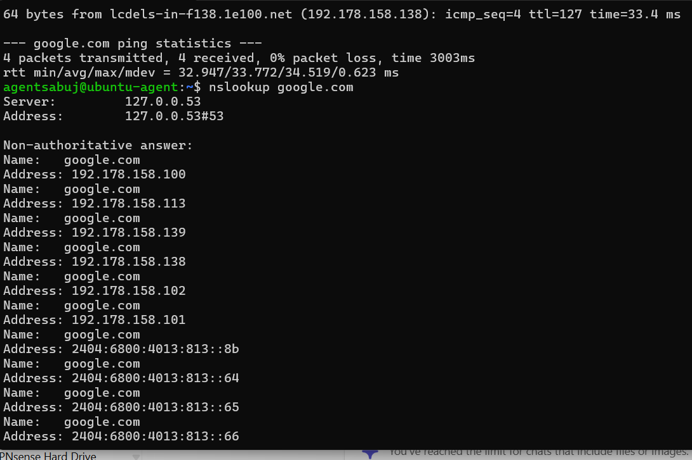
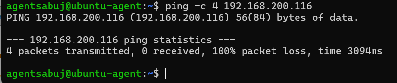
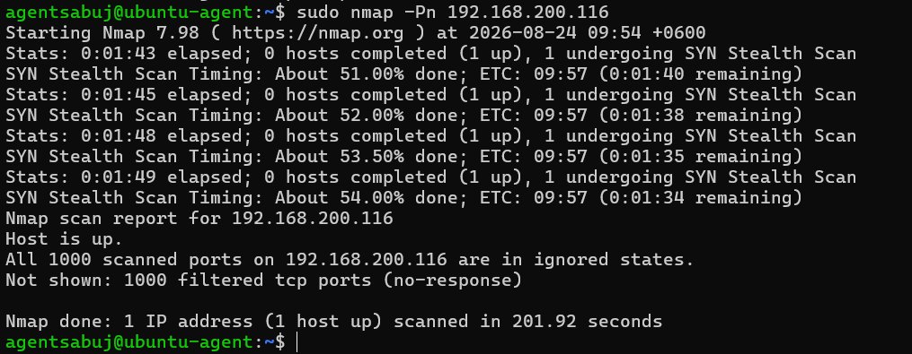
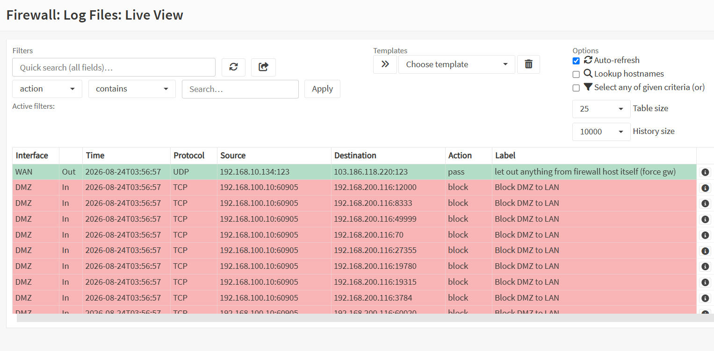
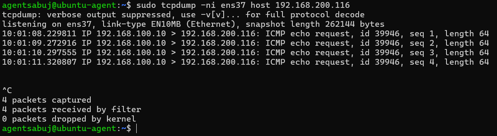

# Phase 06 - Security Testing

## 1. Overview

This phase validates the security controls implemented in the OPNsense firewall and verifies that the DMZ network cannot directly access the trusted LAN.

The testing focuses on:

* DMZ gateway connectivity
* DMZ Internet connectivity
* DMZ-to-LAN ICMP blocking
* DMZ-to-LAN TCP port exposure
* Packet-level traffic verification
* OPNsense firewall enforcement

The objective is to confirm that the implemented network segmentation and firewall policies are functioning as expected.

---

## 2. Security Testing Architecture

The security testing was performed from the Ubuntu Agent located in the DMZ network.

```text
                    OPNsense Firewall
                           │
              ┌────────────┴────────────┐
              │                         │
           DMZ Zone                  LAN Zone
       192.168.100.0/24          192.168.200.0/24
              │                         │
              │                         │
      Ubuntu Agent                 Windows Host
      192.168.100.10              192.168.200.116
              │                         │
              └─────── BLOCK ───────────┘
```

The DMZ is considered less trusted, while the LAN contains trusted internal systems. Therefore, unauthorized DMZ-to-LAN communication should be blocked by the firewall.

---

## 3. DMZ Network Information

The Ubuntu Agent was verified to ensure that it was correctly connected to the DMZ network.

### Commands

```bash
ip addr
ip route
```

The DMZ interface uses:

```text
DMZ IP:      192.168.100.10
DMZ Network: 192.168.100.0/24
Gateway:     192.168.100.1
```



---

## 4. DMZ Gateway Connectivity Test

The first test verifies communication between the Ubuntu Agent and the OPNsense DMZ gateway.

### Command

```bash
ping -c 4 192.168.100.1
```

### Actual Result

```text
4 packets transmitted, 4 received, 0% packet loss
```

This confirms that the Ubuntu Agent can communicate with the OPNsense DMZ interface.



---

## 5. DMZ-to-Internet Connectivity Test

The next test verifies whether the DMZ host can access the Internet through OPNsense.

### Command

```bash
ping -c 4 8.8.8.8
```

### Actual Result

```text
4 packets transmitted, 4 received, 0% packet loss
```

The successful response confirms that outbound Internet connectivity from the DMZ is functioning correctly.



---

## 6. DNS Connectivity Test

DNS functionality was also tested from the DMZ host.

### Commands

```bash
ping -c 4 google.com
```

```bash
nslookup google.com
```

Successful DNS resolution confirms that the DMZ host can resolve external domain names.



---

## 7. DMZ-to-LAN ICMP Security Test

The main security test verifies that the DMZ cannot directly communicate with the trusted LAN.

The target Windows host is:

```text
192.168.200.116
```

### Command

```bash
ping -c 4 192.168.200.116
```

### Actual Result

```text
4 packets transmitted, 0 received, 100% packet loss
```

The failed ping indicates that ICMP traffic from the DMZ to the LAN host is blocked.



### Security Interpretation

```text
DMZ
192.168.100.10
      │
      │ ICMP Request
      ▼
OPNsense Firewall
      │
      X  BLOCK
      │
      ▼
LAN
192.168.200.116
```

This confirms that the DMZ-to-LAN isolation policy is working.

---

## 8. Nmap TCP Port Exposure Test

A controlled Nmap scan was performed against the user's own lab Windows host to verify whether TCP services on the LAN host were exposed to the DMZ.

### Command

```bash
sudo nmap -Pn 192.168.200.116
```

### Actual Result

```text
Starting Nmap 7.98

Nmap scan report for 192.168.200.116
Host is up.

All 1000 scanned ports on 192.168.200.116 are in ignored states.
Not shown: 1000 filtered tcp ports (no-response)
```



### Security Interpretation

The scan did not identify any open TCP services from the DMZ perspective.

The result:

```text
1000 filtered tcp ports
```

indicates that the firewall is filtering the traffic instead of allowing direct access to the LAN host's TCP services.

This provides additional evidence that the DMZ-to-LAN security boundary is functioning.

---

## 9. OPNsense Firewall Block Log

The firewall behavior was verified using the OPNsense Live View.

The test traffic was generated again from the Ubuntu DMZ host:

```bash
ping -c 4 192.168.200.116
```

The corresponding firewall activity was observed in:

```text
Firewall
→ Log Files
→ Live View
```



The firewall log provides direct evidence that the OPNsense policy is enforcing the DMZ-to-LAN restriction.

---

## 10. Packet Capture Verification

Packet-level verification was performed using `tcpdump` on the DMZ interface.

### Command

```bash
sudo tcpdump -ni ens37 host 192.168.200.116
```

The test generated ICMP requests from:

```text
192.168.100.10
```

toward:

```text
192.168.200.116
```

### Observed Traffic

```text
192.168.100.10 > 192.168.200.116: ICMP echo request
```

Multiple ICMP echo requests were observed, but no ICMP echo replies were received from the LAN host.



This confirms at packet level that the DMZ host attempted to communicate with the LAN host, but the communication was not successfully established.

---

## 11. Security Testing Results

| Test           | Source         | Destination     | Expected Result     | Actual Result | Status |
| -------------- | -------------- | --------------- | ------------------- | ------------- | ------ |
| Gateway Ping   | 192.168.100.10 | 192.168.100.1   | Allowed             | Successful    | PASS   |
| Internet Ping  | 192.168.100.10 | 8.8.8.8         | Allowed             | Successful    | PASS   |
| DNS Test       | 192.168.100.10 | Internet DNS    | Allowed             | Successful    | PASS   |
| LAN Ping       | 192.168.100.10 | 192.168.200.116 | Blocked             | 100% loss     | PASS   |
| Nmap TCP Scan  | 192.168.100.10 | 192.168.200.116 | Filtered            | 1000 filtered | PASS   |
| Firewall Log   | DMZ            | LAN             | Block event         | Observed      | PASS   |
| Packet Capture | DMZ            | LAN             | No successful reply | No reply      | PASS   |

---

## 12. Security Validation

The tests confirm the following security controls:

### DMZ Internet Access

```text
DMZ → OPNsense → WAN → Internet
```

Allowed and working.

### DMZ-to-LAN Access

```text
DMZ → OPNsense → LAN
              │
              X BLOCK
```

Blocked as expected.

### TCP Service Exposure

```text
DMZ → LAN Host
       │
       X TCP ports filtered
```

No TCP service was exposed during the controlled Nmap scan.

---

## 13. Conclusion

The Phase-06 security testing successfully validated the OPNsense firewall and network segmentation controls.

The DMZ host was able to:

* Reach the OPNsense DMZ gateway
* Access the Internet
* Resolve external DNS names

However, the DMZ host was unable to directly access the trusted LAN host.

The security controls were validated using:

* ICMP connectivity testing
* Nmap TCP port scanning
* OPNsense firewall logs
* tcpdump packet capture

The combined results demonstrate that the trusted LAN is isolated from the less-trusted DMZ according to the configured firewall policy.

> **Note:** This phase represents firewall and segmentation security validation. It is not a full penetration test or comprehensive vulnerability assessment.

---

## 14. Phase-06 Evidence

The following screenshots provide the evidence collected during this phase:

1. [DMZ Network Information](../screenshots/phase-06/01-dmz-network-info.png)
2. [Gateway Connectivity Test](../screenshots/phase-06/02-gateway-connectivity.png)
3. [Internet Connectivity Test](../screenshots/phase-06/03-internet-connectivity.png)
4. [DNS Connectivity Test](../screenshots/phase-06/04-dns-connectivity.png)
5. [DMZ-to-LAN Block Test](../screenshots/phase-06/05-dmz-lan-block.png)
6. [Nmap DMZ-to-LAN Test](../screenshots/phase-06/06-nmap-dmz-to-lan.png)
7. [OPNsense Firewall Block Log](../screenshots/phase-06/07-firewall-block-log.png)
8. [DMZ Security Packet Capture](../screenshots/phase-06/08-dmz-security-packet-capture.png)

---

## 15. Next Phase

After completing the firewall security testing phase, the next stage will focus on integrating the OPNsense firewall with the centralized **Wazuh SOC monitoring environment**.

The planned workflow is:

```text
                 OPNsense Firewall
                       │
                       │ Firewall Logs
                       ▼
                  Wazuh Server
                       │
          ┌────────────┼────────────┐
          │            │            │
          ▼            ▼            ▼
     Windows Agent  Ubuntu Agent  Security
                                  Monitoring
```

The next phase will focus on centralized security event collection, log analysis, alert monitoring, and SOC visibility using Wazuh.
